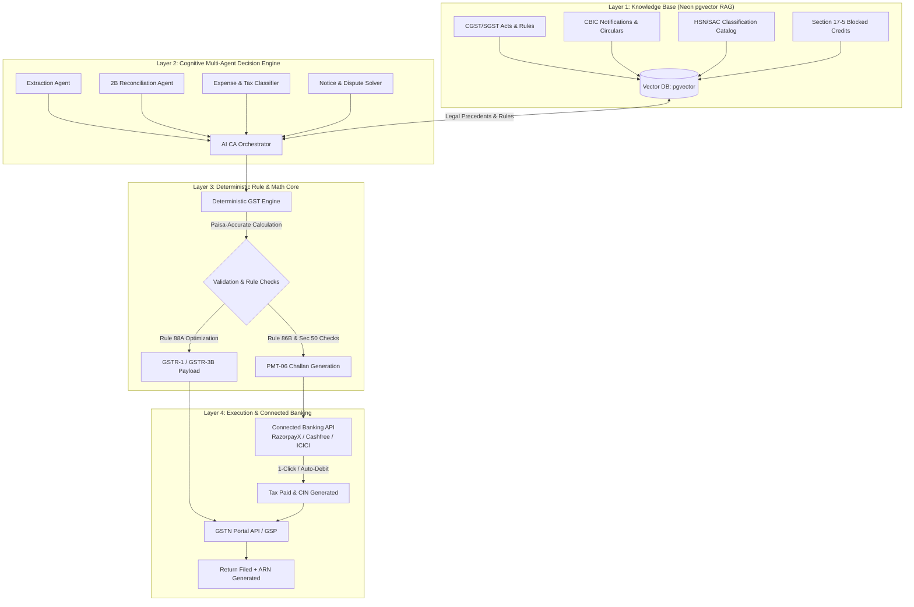
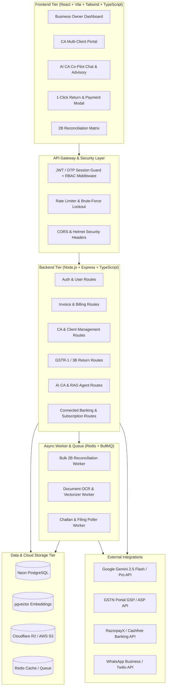

# KhataGST: Master Architecture, Autonomous AI CA & Enterprise Roadmap

---

## 1. Executive Summary & Product Vision

### 1.1 The Vision: The Autonomous AI Chartered Accountant (AI CA)
KhataGST is evolving from a modern GST billing and calculation MVP into a **fully autonomous, AI-driven Chartered Accountant platform**. The system is designed not just to record invoices and calculate tax, but to act as a proactive, continuous financial decision engine with deep tax law intelligence, automated Input Tax Credit (ITC) reconciliation, compliance risk auditing, and **1-Click / Zero-Touch tax payment execution**.

```
  ┌─────────────────────────────────────────────────────────────────────────┐
  │                    KHATAGST: THE AUTONOMOUS AI CA                       │
  ├─────────────────────────────────────────────────────────────────────────┤
  │  • Continuous Knowledge Layer (GST Acts, Rules, Circulars, Case Laws)   │
  │  • Multi-Agent Decision Engine (Expense Classifier, Fraud & 2B Matcher)  │
  │  • Zero-Hallucination Deterministic Math Core (Paisa-Accurate Engine)   │
  │  • 1-Click Autopilot & Connected Banking Tax Payment (PMT-06 / GSTR-3B) │
  └─────────────────────────────────────────────────────────────────────────┘
```

### 1.2 Current Foundation
KhataGST already has a solid commercial base:
- Phone OTP-based authentication
- Business and party management
- Sales and purchase invoice tracking
- GST computation engine (CGST, SGST, IGST)
- GSTR-1 and GSTR-3B summary generation
- Multimodal AI invoice scanning (Gemini OCR)
- CSV / Excel exports and premium UI

---

## 2. Current State Assessment: What We Are Lacking

Although the core idea and MVP are strong, the project currently lacks the enterprise robustness, security guardrails, direct filing capabilities, and deep intelligence required for full market launch.

```
┌───────────────────────────────────────────────────────────────────────────────────────────┐
│                                   CURRENT SYSTEM GAPS                                     │
├──────────────────────┬──────────────────────┬──────────────────────┬──────────────────────┤
│ 1. P0 Security       │ 2. Core Compliance   │ 3. Enterprise & CA   │ 4. Ops & Storage     │
│    & Auth Gaps       │    & Filing Gaps     │    Collaboration     │    Infrastructure    │
├──────────────────────┼──────────────────────┼──────────────────────┼──────────────────────┤
│ • Hardcoded JWT      │ • No direct GSTN API │ • Single user per    │ • Local disk uploads │
│   fallback secret    │   filing / ARN fetch │   business model     │   instead of S3/R2   │
│ • Admin hardcoded    │ • No 2B vs Books ITC │ • No CA portal with  │ • No Razorpay webhook│
│   email allowlist    │   reconciliation     │   multi-client view  │   verification       │
│ • Missing rate-limit │ • No immutable audit │ • No role-based      │ • Missing Sentry     │
│   & OTP lockouts     │   trail / changelog  │   approval workflows │   and logs tracking  │
└──────────────────────┴──────────────────────┴──────────────────────┴──────────────────────┘
```

### 2.1 Critical P0 Security & Infrastructure Gaps
1. **Hardcoded Secrets**: Fallback to default `"change-this-secret"` in server bootstrap if environment variables are missing.
2. **Hardcoded Admin Logic**: Admin authorization relies on an email allowlist array instead of database-driven Role-Based Access Control (RBAC).
3. **Local File Storage**: Uploaded scan receipts reside on local disk (`uploads/`), preventing multi-instance deployment and horizontal scaling.
4. **Auth & Rate Limiting Vulnerabilities**: Missing phone-specific OTP rate limiting, cooldown protection, brute-force lockout, and session revocation.
5. **Billing Lifecycle Vulnerabilities**: Razorpay payment flow lacks webhook signature verification, idempotency safety, and strict server-side plan limit enforcement.

### 2.2 Core Compliance & Filing Gaps
1. **No Live GSTN Portal Integration**: The platform calculates return JSONs but cannot communicate with the government GST Portal (via GSP/ASP APIs) to auto-fetch GSTR-2B or file GSTR-1/3B.
2. **Missing GSTR-2B ITC Reconciliation**: No automated matching between vendor-uploaded GSTR-2B data and local purchase registers to identify missing invoices, tax discrepancies, or non-compliant suppliers.
3. **Lack of Audit Trails**: Missing immutable audit logs (`created_by`, `updated_by`, previous field snapshots, timestamps, and modification reasons).

---

## 3. The Autonomous "AI CA" Architecture

KhataGST solves the dilemma between **AI intelligence** and **regulatory/financial safety** by implementing a **4-Layer System**:



---

### 3.1 Layer 1: The Knowledge Layer (RAG + pgvector)
The "Tax Brain" of KhataGST uses a high-performance vector store (`pgvector` in Neon PostgreSQL):
- **Statutory Embeddings**: Complete text of the CGST Act, SGST Acts, IGST Act, and CGST Rules (2017–2026).
- **Tax Law Knowledge**:
  - **Section 16**: Eligibility and conditions for taking Input Tax Credit.
  - **Section 17(5)**: Explicit blocked credit categories (motor vehicles, food/catering, health insurance, club memberships, personal consumption).
  - **Rule 36(4) & Rule 88A**: Order of ITC set-off (IGST against IGST -> CGST -> SGST).
  - **Rule 86B**: Restriction on utilization of ITC (1% minimum cash liability for turnover > ₹50 Lakhs/month).
- **Automated Ingestion**: Web scrapers sync newly published CBIC notifications, circulars, and GST council rate modifications.
- **GST Notice Resolver**: Parses incoming tax notices (e.g., ASMT-10, DRC-01, DRC-01A) and drafts legally referenced reply letters with matching citations.

---

### 3.2 Layer 2: Cognitive Multi-Agent Decision Engine
1. **Extraction Agent**: Multimodal Vision model extracts structured line items, HSN/SAC codes, tax slabs, and vendor GSTIN from scanned receipts.
2. **Expense & Credit Classifier Agent**: Analyzes item descriptions against Section 17(5) to automatically flag blocked ITC and recommend proper accounting heads.
3. **Vendor Risk & Anomaly Agent**:
   - Checks supplier GSTIN status (Active, Suspended, Cancelled) against the GST API.
   - Computes a **Vendor Compliance Score** based on timely GSTR-1 filings.
   - Detects invoice duplication, date anomalies, and tax slab mismatches.
4. **ITC Maximizer Agent**: Computes the mathematically optimal credit utilization order to legally minimize the cash component of the tax liability.

---

### 3.3 Layer 3: Deterministic Rule & Math Core (Zero Hallucination)
> [!IMPORTANT]
> Large Language Models must **never** perform raw tax calculations directly in neural weights. The LLM acts as the **classifier, extractor, and advisor**, while the **Deterministic Engine** handles all arithmetic, ensuring 100% precision down to the paisa.

- **Exact Tax Calculations**: Computes taxable value, CGST, SGST, IGST, and Cess across all invoice line items.
- **Rule 88A Set-off Engine**: Executes deterministic linear credit offset equations.
- **Interest & Penalty Calculator**: Implements Section 50 interest rules (18% / 24% p.a.) and late fees for delayed filings.

---

### 3.4 Layer 4: Automated Tax Payment & Filing (Connected Banking)

#### Legal & Regulatory Feasibility in India:
- In India, direct unmonitored bank debits violate RBI 2FA regulations and carry extreme liability under Section 132 of the CGST Act.
- KhataGST achieves safe, automated execution via **Connected Banking APIs** (e.g., RazorpayX, Cashfree Connected Banking, ICICI / HDFC Corporate Banking APIs) and **GST Suvidha Provider (GSP)** integrations.

#### Execution Modes:

```
                          ┌──────────────────────────────────────────────┐
                          │         AUTOMATED PAYMENT WORKFLOWS          │
                          └──────────────────────┬───────────────────────┘
                                                 │
                  ┌──────────────────────────────┴──────────────────────────────┐
                  ▼                                                             ▼
     Mode A: 1-Click Autopilot (Recommended)                      Mode B: Pre-Approved Mandate Auto-Debit
     • AI completes 2B matching & return draft.                  • User authorizes monthly budget cap (e.g. ₹50k).
     • Generates GST PMT-06 challan on portal.                   • AI executes auto-debit if liability variance < 5%.
     • Sends WhatsApp / Push with 1-Click Approval.              • Notification sent 24 hours prior with cancel button.
     • User approves with 1 biometric/PIN tap.                   • Bank executes transfer directly to GST CPIN.
```

1. **Challan Auto-Generation**: The system creates the GST PMT-06 payment challan on the GST portal via GSP API and retrieves the **CPIN (Common Portal Identification Number)**.
2. **Settlement**: Connected Banking initiates a direct NEFT/RTGS/NetBanking payout to the GST Portal Virtual Account.
3. **Filing Verification**: Once the Challan Identification Number (CIN) is credited to the electronic cash ledger, the system triggers GSTR-3B submission with the authorized DSC/EVC token.

---

## 4. System Architecture: Separated Frontend & Backend



---

### 4.1 Frontend Architecture (`/frontend`)
- **Framework**: React 18+ with TypeScript and Vite.
- **State Management & Data Fetching**: TanStack Query (React Query) for server state caching, optimistic updates, and background refetching.
- **Styling & UI**: TailwindCSS, Lucide Icons, Framer Motion for micro-interactions, Headless UI.
- **Dedicated Portals**:
  - **Business Owner Hub**: Invoicing, receivables/payables, quick tax view, 1-Click filing modal.
  - **CA Client Command Center**: Multi-client switcher, bulk client status, review queues, batch approval.
  - **AI CA Conversational Copilot**: Side-panel chat with streaming tax advice, legal citations, and notice drafts.
  - **Interactive 2B Reconciliation Matrix**: Side-by-side comparison of local purchase records vs. GSTN portal data with one-click match/ignore/dispute actions.
- **Real-Time Updates**: Server-Sent Events (SSE) / WebSockets for live OCR processing and filing status updates.

---

### 4.2 Backend Architecture (`/src`)
- **Runtime**: Node.js with TypeScript and Express.js.
- **Modular Directory Structure**:
  - `src/controllers/`: Request handling and response formatting.
  - `src/routes/`: Route declarations with route-level RBAC guards.
  - `src/services/`: Pure business logic (GST calculation, GSTR-1, GSTR-3B, OCR, RAG, Connected Banking).
  - `src/agents/`: Multi-agent orchestration (Classifier Agent, Reconciler, Anomaly Detector).
  - `src/knowledge/`: Vector search, embeddings generation, statutory legal chunking.
  - `src/middleware/`: JWT verification, role-based access, error handlers, rate limiters.
  - `src/lib/`: Database clients (Neon Postgres, S3 client, Redis connection).
  - `src/jobs/`: BullMQ worker jobs for heavy async processing (bulk OCR, 2B sync).
- **Database & Storage**:
  - **Relational DB**: Neon PostgreSQL (Connection pooling, auto-scaling).
  - **Vector DB**: `pgvector` extension inside Neon for legal and invoice embeddings.
  - **Document Storage**: AWS S3 / Cloudflare R2 with signed URLs (private bucket).
  - **Queue / Cache**: Redis for async jobs, rate limiting, and session caching.

---

## 5. Comprehensive Implementation Roadmap

```
  Phase 1: Launch-Safe Security & Infrastructure (Weeks 1–4)
  Phase 2: The AI CA Knowledge Layer & RAG Engine (Weeks 5–8)
  Phase 3: Real GSTN API Integration & 2B Reconciliation (Weeks 9–12)
  Phase 4: Connected Banking & 1-Click Autopilot (Weeks 13–16)
  Phase 5: CA Enterprise Platform & Ecosystem (Weeks 17–20)
```

---

### Phase 1: Launch-Safe Security & Infrastructure (Weeks 1–4)
**Goal**: Eliminate all P0 blockers and make the application production-ready.

- [ ] **P0-1**: Enforce mandatory random `JWT_SECRET` via environment configuration; crash gracefully on startup if missing.
- [ ] **P0-2**: Replace email allowlists with database-driven RBAC (`roles`, `permissions`, `user_roles`).
- [ ] **P0-3**: Migrate file uploads from local disk to Cloudflare R2 / AWS S3 using presigned URLs.
- [ ] **P0-4**: Add Redis-based rate limiting on phone OTP requests, resend cooldowns, and brute-force lockout.
- [ ] **P0-5**: Implement Razorpay webhook signature verification with idempotent event logging.
- [ ] **P0-6**: Integrate Sentry for error tracking, Pino for structured JSON logging, and `/health` probes.
- [ ] **P0-7**: Set up Neon automated daily backups and disaster recovery runbooks.

---

### Phase 2: The AI CA Knowledge Layer & RAG Engine (Weeks 5–8)
**Goal**: Build the intelligent "Tax Brain" capable of expense classification and legal advice.

- [ ] **K-1**: Enable `pgvector` on Neon PostgreSQL and create schema for statutory tax embeddings.
- [ ] **K-2**: Ingest and vectorize the CGST/SGST/IGST Acts, Rules, HSN Directory, and Section 17(5) blocked credit rules.
- [ ] **K-3**: Implement the **Expense & Credit Classifier Agent** to auto-tag blocked ITC on purchase bills.
- [ ] **K-4**: Build the **AI Tax Advisory Copilot** side-panel on the frontend with streaming responses and legal citations.
- [ ] **K-5**: Develop the **GST Notice Resolver** to parse notice PDFs and auto-generate legal response drafts.

---

### Phase 3: Real GSTN API Integration & 2B Reconciliation (Weeks 9–12)
**Goal**: Move from calculation-only to live government data synchronization.

- [ ] **G-1**: Integrate with GSP Sandbox/Production APIs (e.g., ClearTax / MasterGST / NIC GST API).
- [ ] **G-2**: Implement automated monthly download of supplier GSTR-2B data.
- [ ] **G-3**: Build the **Automated ITC Reconciliation Engine** (Fuzzy matching on Invoice No, Date, GSTIN, Amount):
  - Category 1: Fully Matched (Auto-claim ITC)
  - Category 2: Mismatched Value / Tax (Auto-flag for correction)
  - Category 3: In Books but missing in 2B (Auto-defer ITC & generate vendor reminder)
  - Category 4: In 2B but missing in Books (Auto-prompt to add purchase)
- [ ] **G-4**: Build the interactive **2B Reconciliation Matrix UI** on the frontend.
- [ ] **G-5**: Implement live return payload submission to GSTN and capture ARN upon successful filing.

---

### Phase 4: Connected Banking & 1-Click Autopilot (Weeks 13–16)
**Goal**: Automate tax payment execution with zero user friction.

- [ ] **B-1**: Integrate Connected Banking APIs (RazorpayX / Cashfree / ICICI Connected Banking).
- [ ] **B-2**: Implement automatic GST PMT-06 challan generation and CPIN tracking.
- [ ] **B-3**: Build the **1-Click Autopilot Approval Flow**:
  - Auto-generate return summaries on the 18th of every month.
  - Trigger WhatsApp / Email interactive notification with breakdown and payment link.
  - Execute direct payment to the GST Portal Virtual Account upon 1-Click approval.
- [ ] **B-4**: Implement **Pre-Approved Mandate Auto-Debit** with configurable budget limits and 24-hour advance cancellation alerts.
- [ ] **B-5**: Build real-time payment status polling and automatic cash ledger balance verification.

---

### Phase 5: CA Enterprise Platform & Scale (Weeks 17–20)
**Goal**: Deliver a dedicated multi-tenant workspace for CAs, accountants, and enterprises.

- [ ] **E-1**: Build the **CA Command Center Dashboard** with multi-client switching, client health scores, and filing due-date trackers.
- [ ] **E-2**: Implement Granular Client Access Permissions (Read-Only, Accountant, Approver, Authorized Signatory).
- [ ] **E-3**: Build a spreadsheet **Bulk Import / Migration Wizard** (supporting Tally, Busy, Zoho, and custom Excel templates).
- [ ] **E-4**: Implement automated **WhatsApp / Email Reminders** for customer receivables and vendor missing invoice follow-ups.
- [ ] **E-5**: Add immutable audit trail logging (`audit_logs` table) with change history comparisons.

---

## 6. Detailed Feature & Technical Backlog

### Epic 1: Security, Auth & RBAC
| Story ID | Description | Acceptance Criteria |
|---|---|---|
| `SEC-101` | JWT Secret Hardening | App crashes on boot if `JWT_SECRET` is missing; no fallback string in codebase. |
| `SEC-102` | Database RBAC Migration | Roles table (`owner`, `admin`, `ca`, `accountant`, `viewer`) enforced across all API endpoints. |
| `SEC-103` | OTP Brute-force Protection | Max 3 OTP sends per 10 mins per phone; 5 failed attempts locks phone for 1 hour. |
| `SEC-104` | S3/R2 Cloud Object Storage | File uploads generate presigned S3 URLs; local disk writes deprecated. |

### Epic 2: AI CA & Knowledge Engine
| Story ID | Description | Acceptance Criteria |
|---|---|---|
| `AI-201` | `pgvector` Schema Setup | Vector extension enabled in Neon; embedding table indexed with HNSW. |
| `AI-202` | Statutory Knowledge Ingestion | CGST/SGST Acts & Sec 17(5) chunked and embedded; cosine similarity < 0.2s. |
| `AI-203` | Section 17(5) Blocked ITC Classifier | Extracted bill line items auto-tagged with blocked status and legal explanation. |
| `AI-204` | AI Tax Copilot API | Streaming SSE chat endpoint capable of answering tax questions with section references. |

### Epic 3: GSP & ITC 2B Reconciliation
| Story ID | Description | Acceptance Criteria |
|---|---|---|
| `GST-301` | GSP API Gateway Adapter | Service module to authenticate with GSTN sandbox/production. |
| `GST-302` | GSTR-2B Automated Sync | Background job fetches GSTR-2B JSON on the 14th of each month. |
| `GST-303` | Reconciliation Algorithm | Reconciles 1,000 invoices in < 3 seconds into 4 standard match buckets. |
| `GST-304` | Direct GSTR-1 / 3B Filing | Submits return payload to GSTN and stores returned ARN in database. |

### Epic 4: Connected Banking & Payment Autopilot
| Story ID | Description | Acceptance Criteria |
|---|---|---|
| `PAY-401` | PMT-06 Challan Generator | Generates CPIN via GSP API with breakdown of Cash and Credit ledger. |
| `PAY-402` | Connected Banking Payout | Initiates NEFT/RTGS payout to GST CPIN via RazorpayX / Cashfree API. |
| `PAY-403` | 1-Click WhatsApp Approval | Sends interactive WhatsApp message with return summary and 1-Click authorization link. |
| `PAY-404` | Ledger Auto-Verification | Verifies CIN update in GST Portal cash ledger before final 3B submission. |

---

## 7. Launch Readiness Checklist

```
Security & Compliance
[ ] Production secrets injected via environment; zero default fallbacks
[ ] Database RBAC enforced across all routes
[ ] OTP rate limits & brute force lockouts active
[ ] Cloud Object Storage (S3/R2) configured with private access
[ ] Razorpay webhooks verified via HMAC SHA256 signatures
[ ] CORS restricted to production frontend domains

Reliability & Operations
[ ] Sentry error tracking active on backend and frontend
[ ] Pino structured logging configured
[ ] `/health` endpoint returning database and Redis statuses
[ ] Automated Neon PostgreSQL daily backups configured
[ ] BullMQ async worker queues running for background jobs

AI CA & Tax Engines
[ ] `pgvector` knowledge layer deployed and indexed
[ ] Section 17(5) blocked credit rules verified against sample invoices
[ ] Rule 88A set-off math tested against 100+ tax liability edge cases
[ ] Connected Banking payout sandbox tested end-to-end with challan flow
```

---

## 8. Summary

By executing this roadmap, **KhataGST transforms from an MVP invoice calculator into an enterprise-grade Autonomous AI CA**. The platform provides full legal compliance, robust zero-hallucination math, deep statutory tax knowledge, and frictionless **1-Click tax payment execution**, positioning KhataGST at the cutting edge of the Indian fintech and enterprise compliance market.
